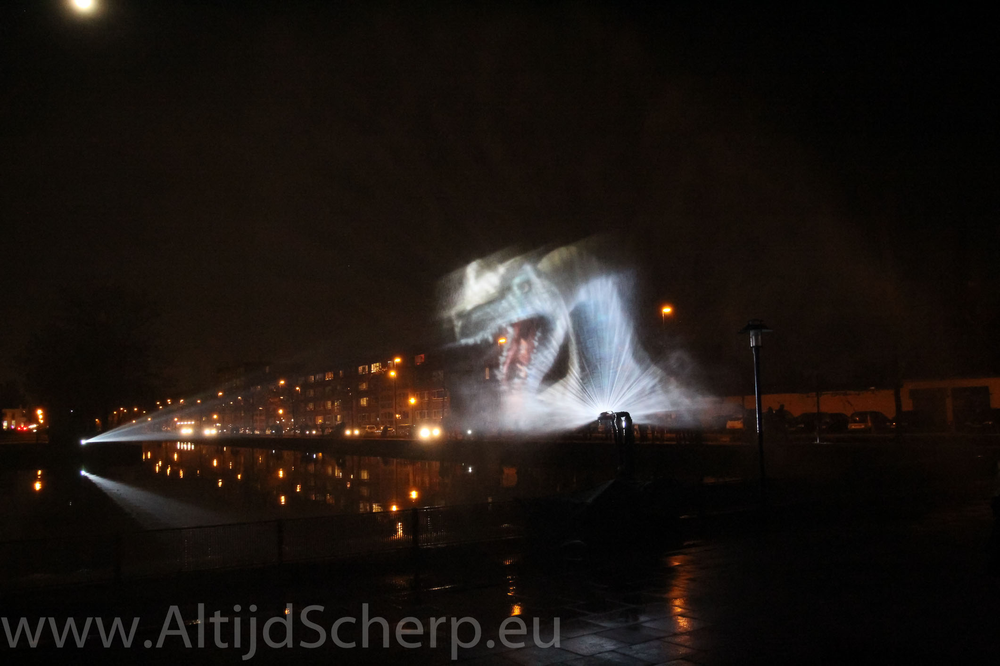
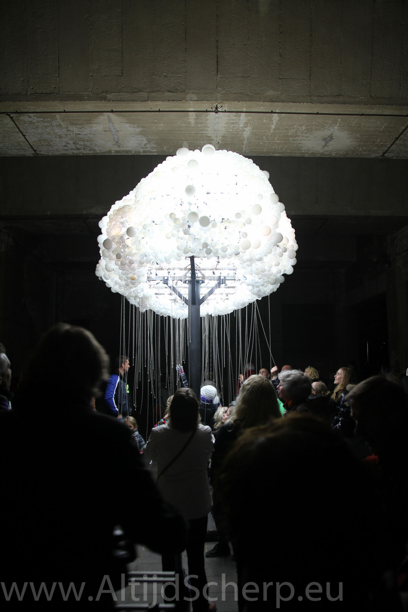
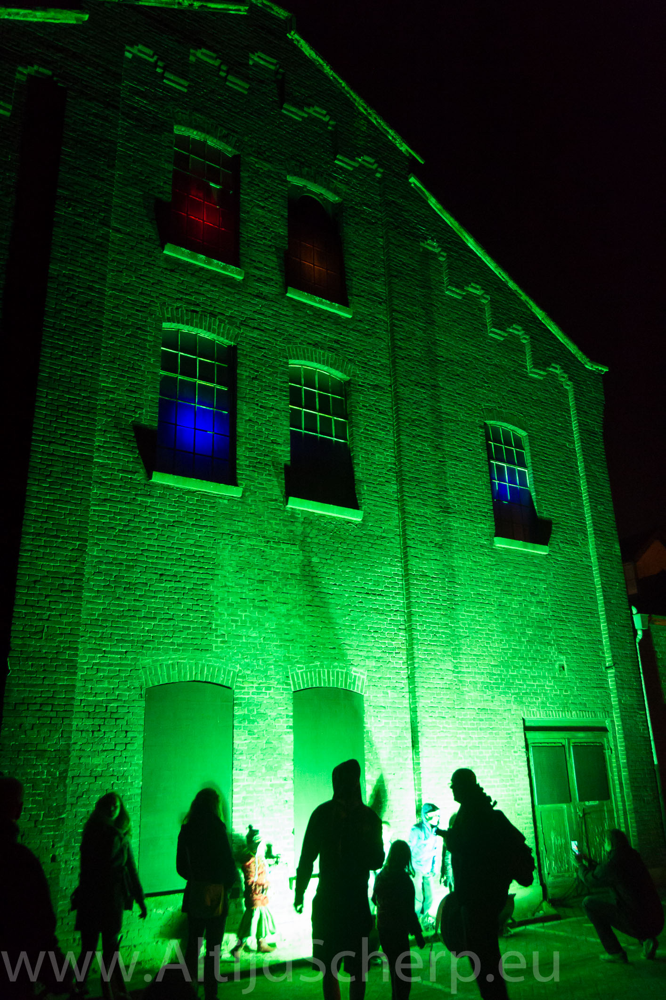
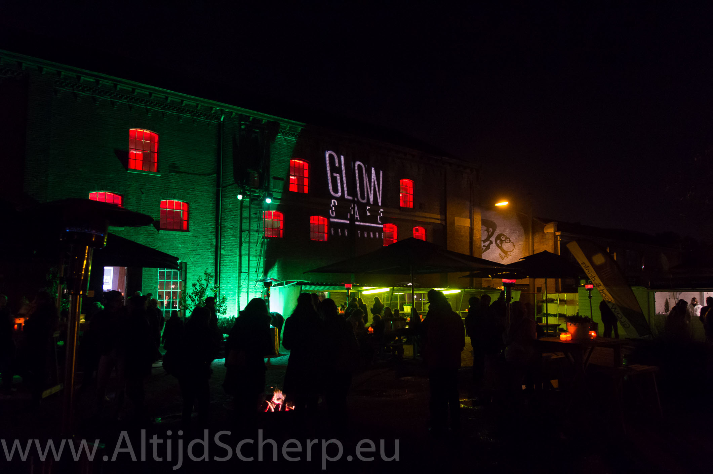
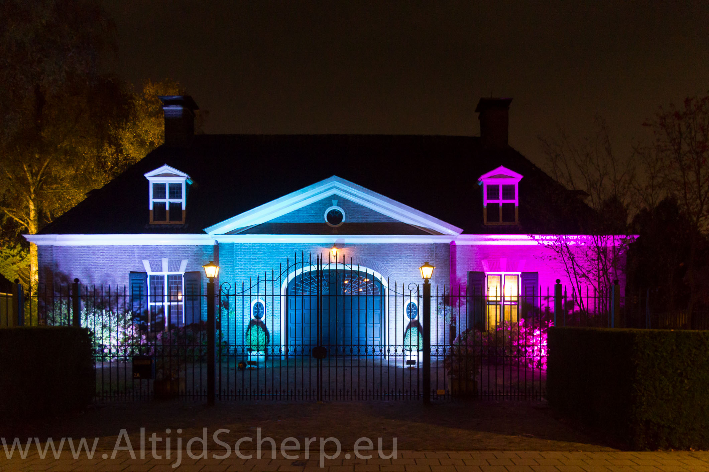
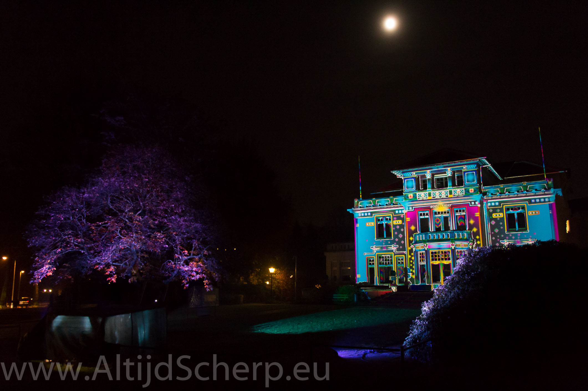
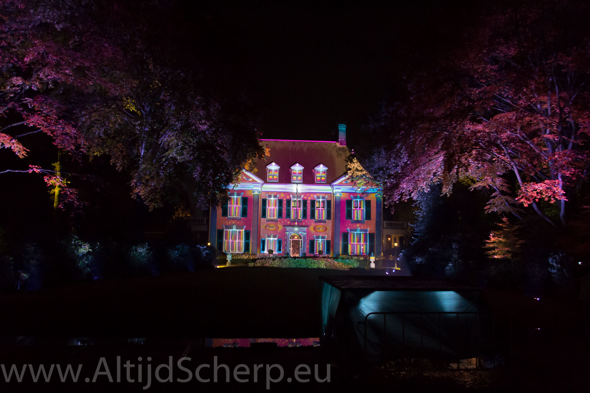
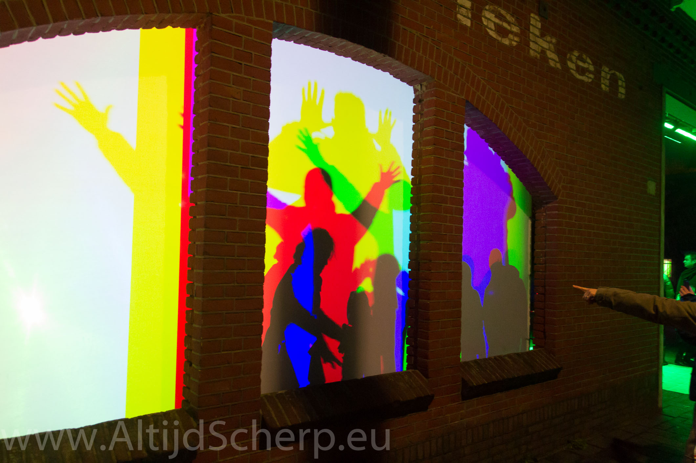

\

## Foto’s

Ja, wat kan ik er van zeggen. Elke fotograaf kijkt er naar uit, een half miljoen mensen hebben 'Eindje' bezocht. Kan er misschien weinig aan toevoegen, maar doe het dan toch ;-)