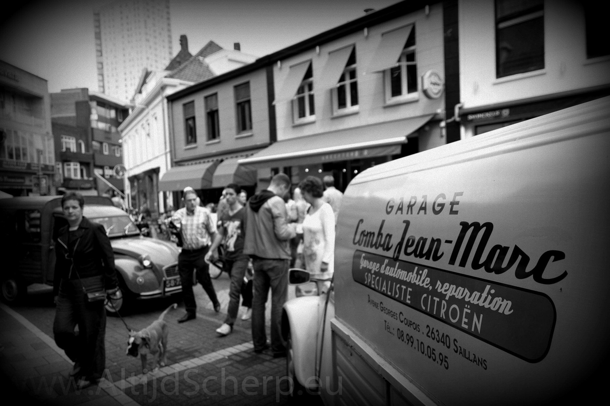
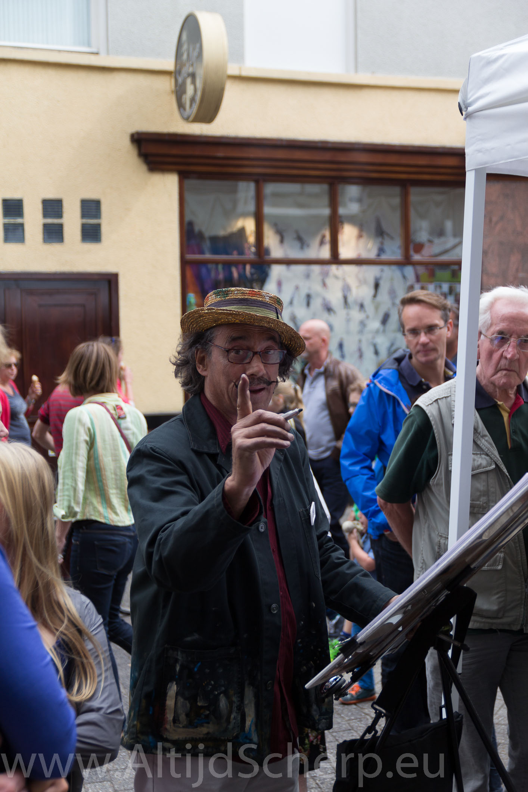
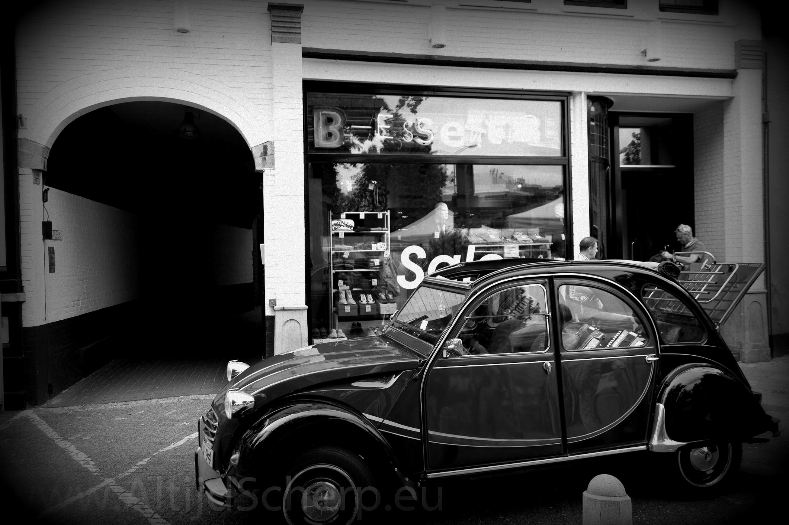
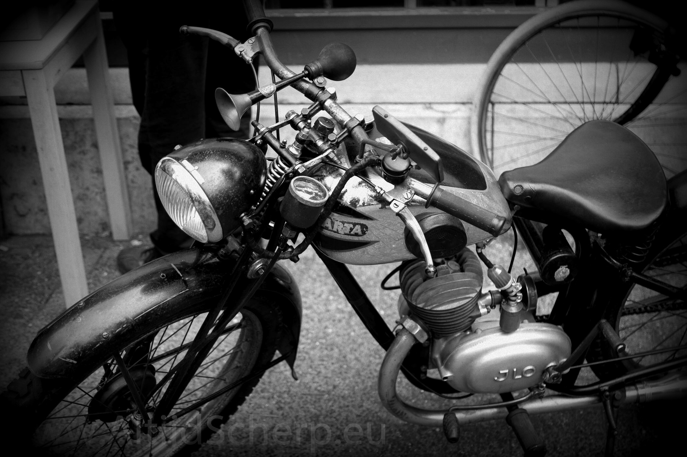
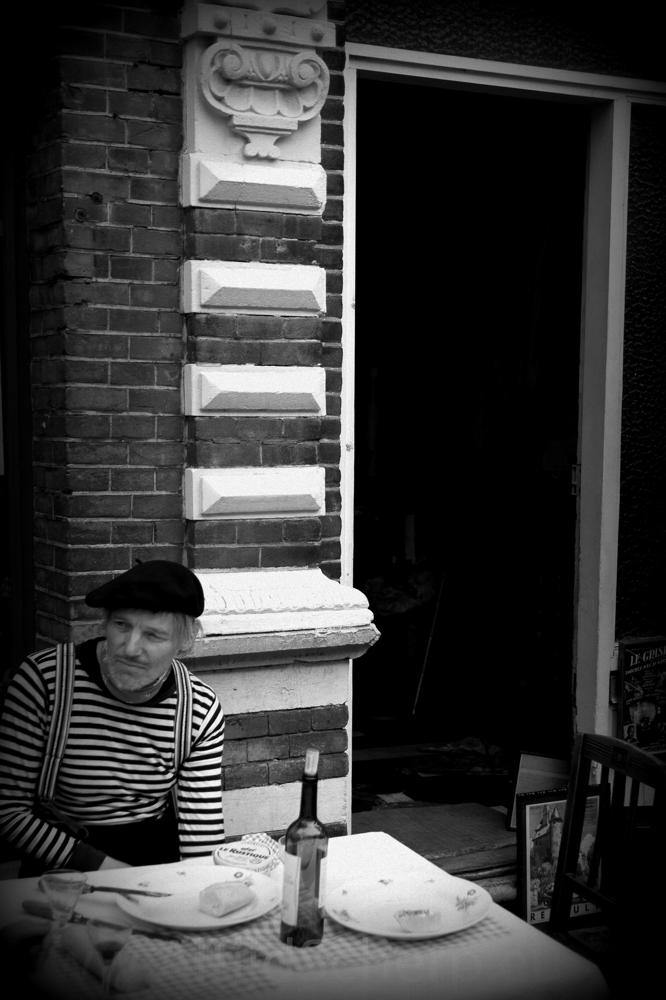
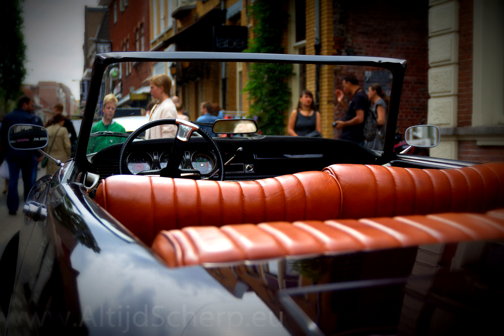
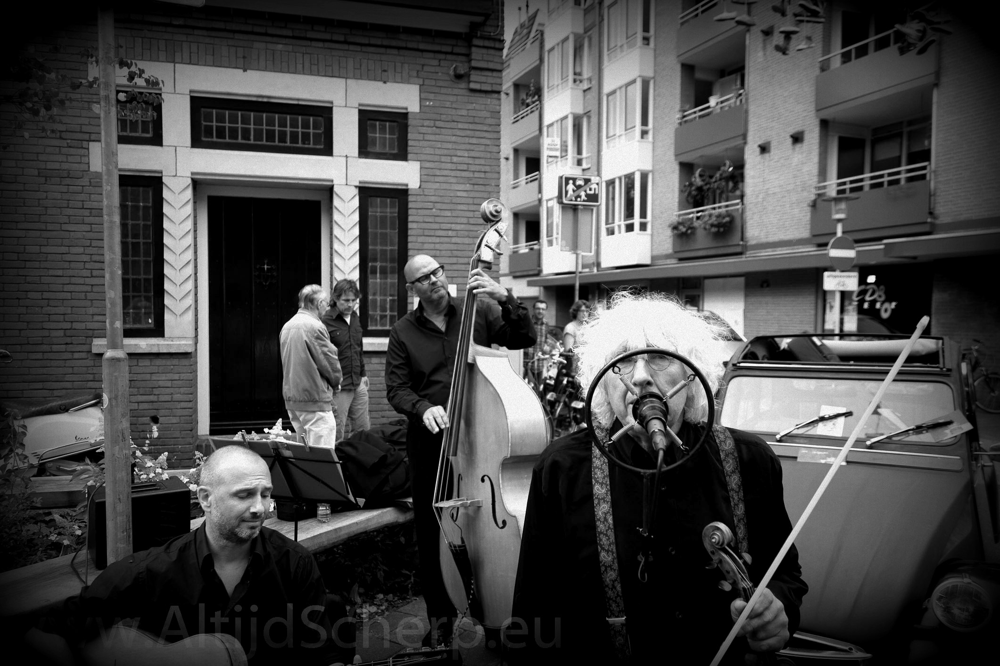
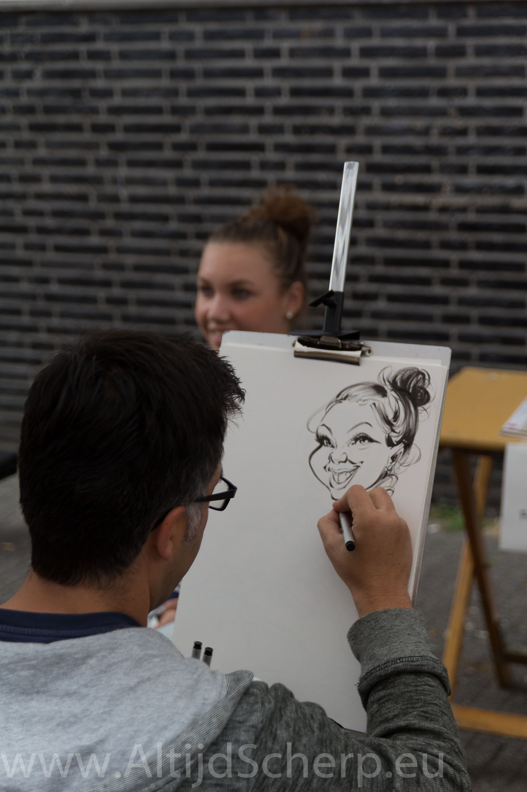
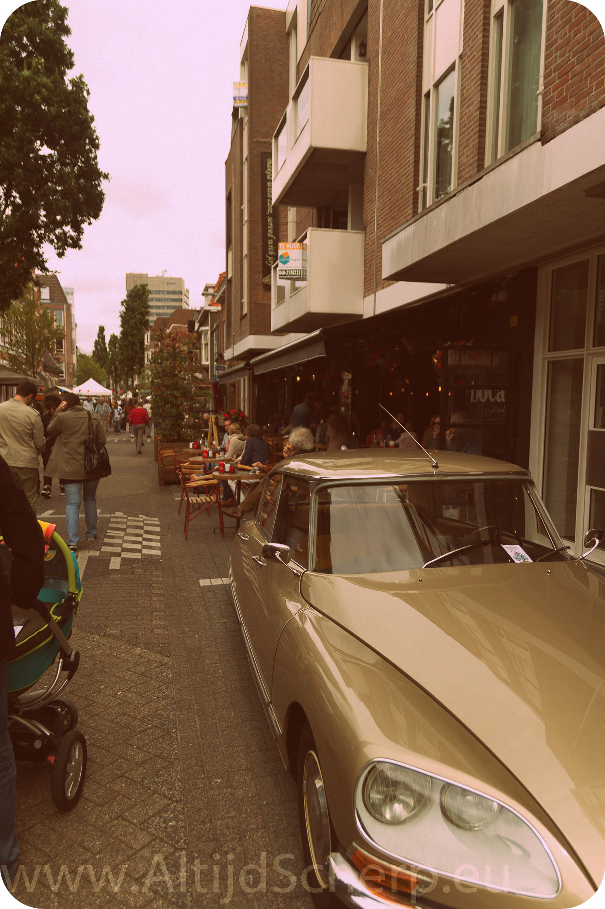

\

## Foto’s

De beste binnenstad van Nederland had weer een geweldig evenement: Montmartre. Een jaarlijks buurtfeest in de Bergen met striptekenaars en veel straatactiviteiten. De moeite waard zoals u ziet. Hier alvast een paar kiekjes voordat ondergetekende ging borrelen!