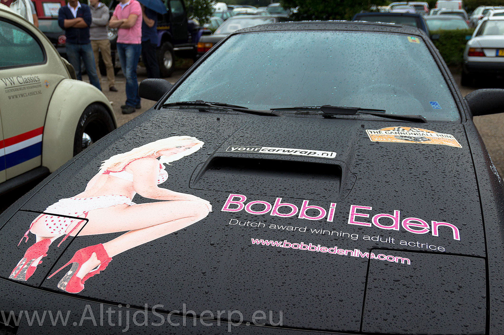
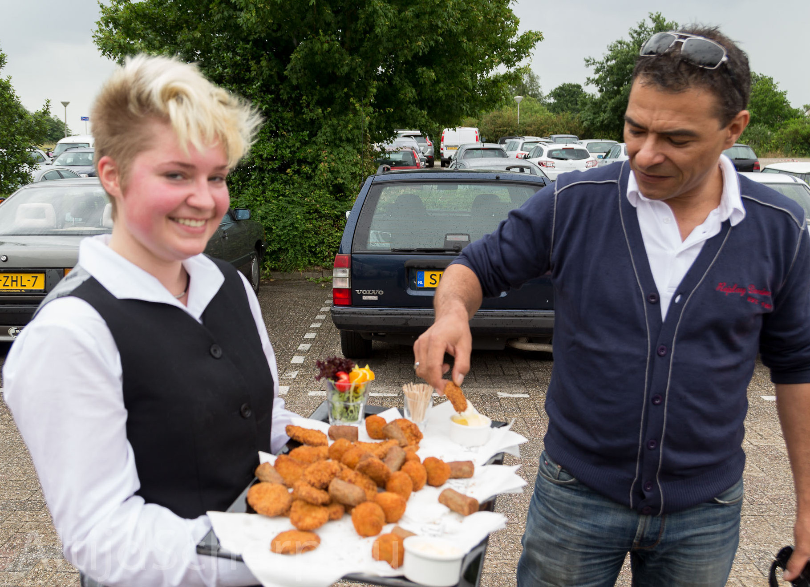
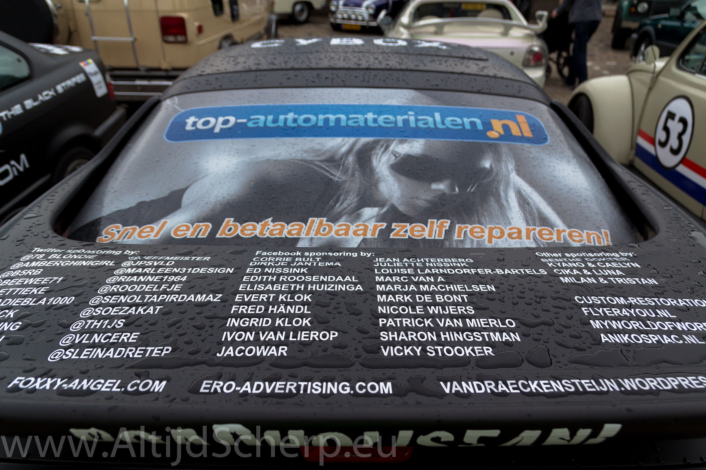
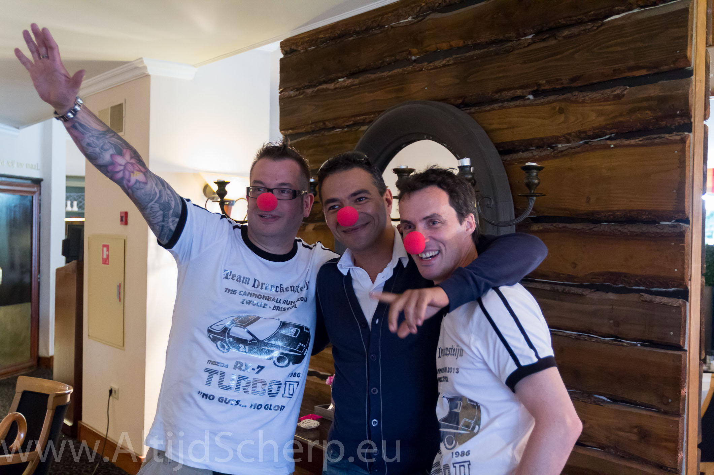
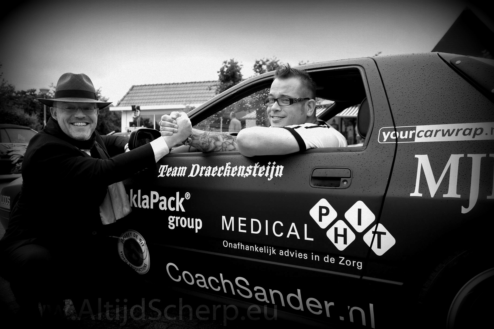
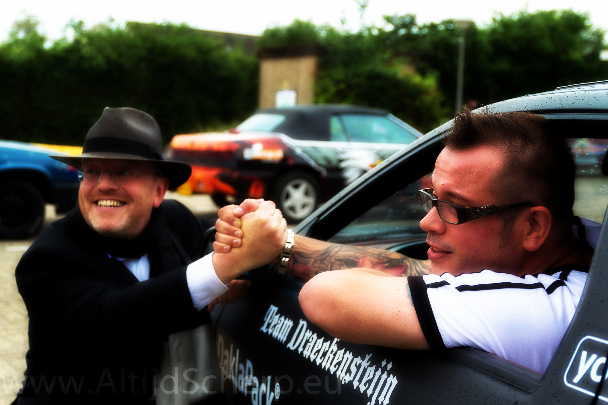

\

## Foto’s

Eind juni was de briefing van de Cannonball Run in Zwolle. Omdat ik 1 van de teams sponsor moest ik natuurlijk even mijn gezicht laten zien en heb gelijk van de gelegenheid gebruik gemaakt om e.e.a op de gevoelige plaat te zetten!

Natuurlijk was het team blij met de fraaie foto's en de extra exposure!