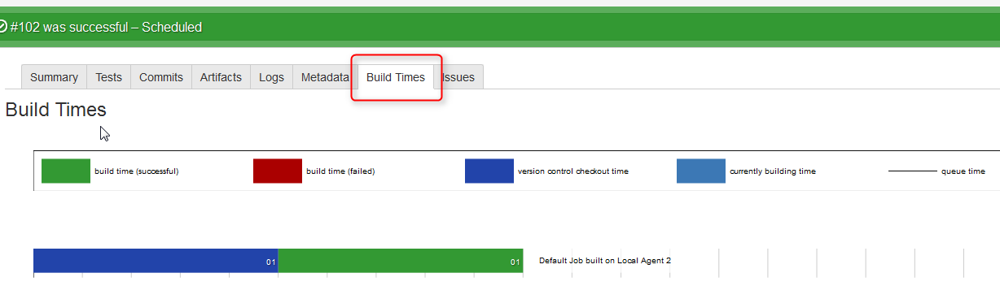
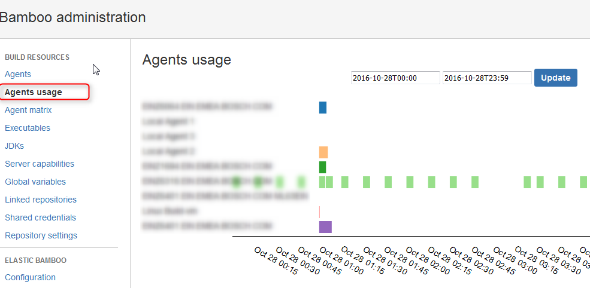
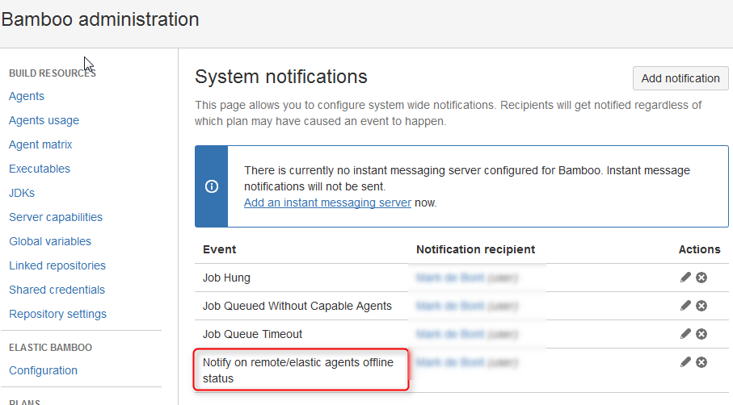

In the last month's Atlassian Labs has introduced several new Bamboo plug ins to help monitoring your builds and pinpointing bottle necks in your build farm.

Let's review three of the most interesting ones for build managers that have problems identifying bottlenecks and optimizing performance.

## Build Times

The first one is "Build Times". The plugin was available for older instances but support for 5.10+ has been added recently. The plugin automates the effort of going manually through the log file and writing down the timings for each step.

It add a "Build Times" tab to existing jobs showing not only Build Times but also queue time, actual build time and the time for git to checkout the sources.

Very powerful as it also allows end-users to identify why their job took so long.

[https://marketplace.atlassian.com/plugins/com.atlassian.bamboo.plugin.bamboo-build-times-plugin/server/overview](https://marketplace.atlassian.com/plugins/com.atlassian.bamboo.plugin.bamboo-build-times-plugin/server/overview)

## Agent Usage

After installing the Build Times plugins the administrator is left with the task to identify which agents are idling and which are working overtime.

And because Bamboo license model is based on agent you want to make sure that the load is evenly spread and agent are efficiently put to use.

With the plugin it shows a list of all the agent and the time their are in use, quickly pinpointing bottlenecks. Adding or removing capabilities to agent can solve possible bottlenecks.

[https://marketplace.atlassian.com/plugins/com.atlassianlab.bamboo.plugins.bamboo-agents-usage/server/overview](https://marketplace.atlassian.com/plugins/com.atlassianlab.bamboo.plugins.bamboo-agents-usage/server/overview)

## Bamboo Agent Notification

Build Manager having a large amount of agent now already the problem. Agents go off-line for an various amount of reasons and only find out after a long period when jobs are hanging or build throughput slows down.

With this agent you can add notifications so you're immediately informed of build agent going off-line. This way you can quickly respond on any problems so users don't notice any outages.

[https://marketplace.atlassian.com/plugins/com.atlassianlab.bamboo.plugins.bamboo-agent-notification-plugin/server/overview](https://marketplace.atlassian.com/plugins/com.atlassianlab.bamboo.plugins.bamboo-agent-notification-plugin/server/overview)