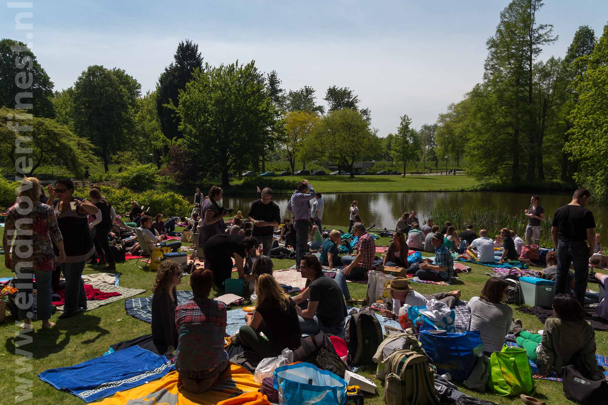
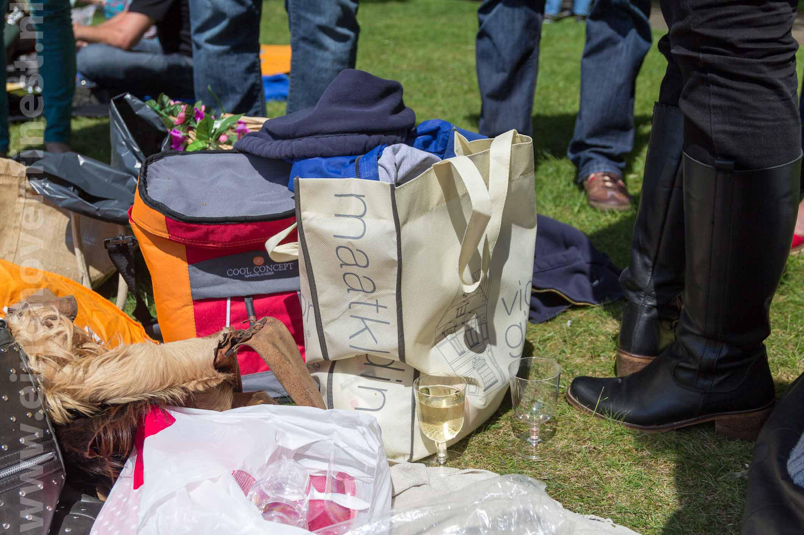
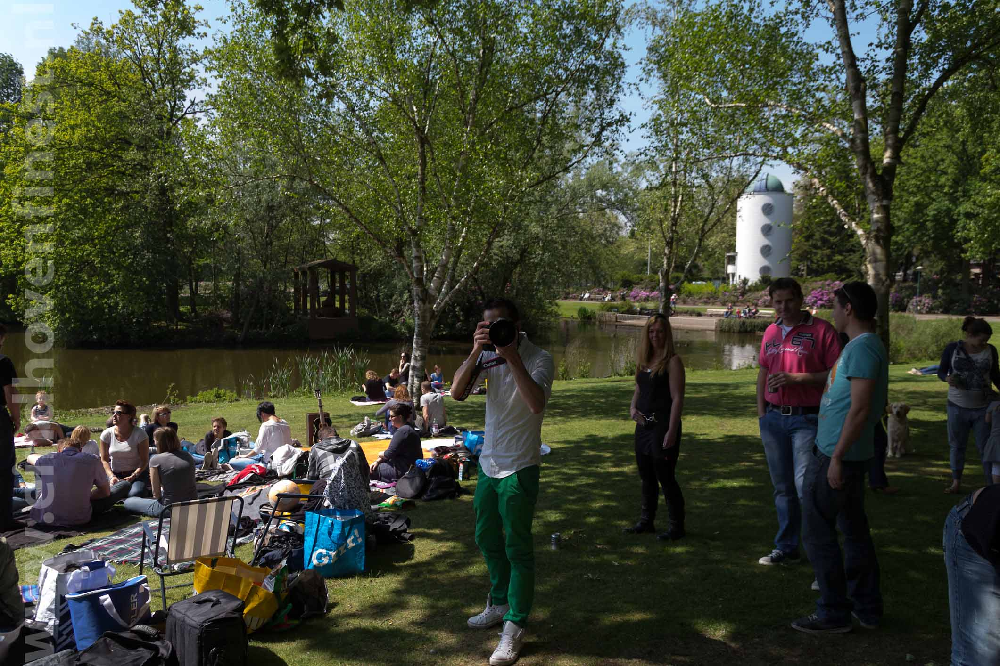

\[caption id="attachment\_757" align="alignnone" width="640"\] BYO Picknick #040 2012\[/caption\]

Volle bak in het stadswandelpark

\[caption id="attachment\_756" align="alignnone" width="640"\] BYO Picknick #040 2012\[/caption\]

Iedereen bracht lekkere hapjes mee... Alhoewel sommige met alleen drank aan kwamen zetten

\[caption id="attachment\_755" align="alignnone" width="640"\] BYO Picknick #040 2012\[/caption\]

Evenement werd druk gecovered door de internationale media!

En niet te vergeten grote dank aan [@ElluhZelluf](http://twitter.com/#!/elluhzelluf) die dit allemaal georganiseerd heeft!