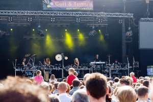
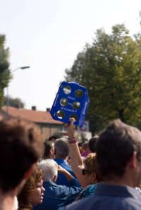
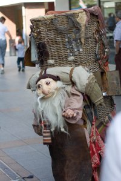
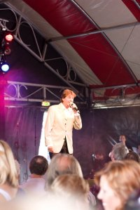

Slagerij van Kampen doet z'n ding  

Bavaria aanwezig!

  

Straattheater

  

En natuurlijk: Albert West!

  
Strakke timing daar in Veldhoven. 18:00 laatste act van Folkaholics en 18:30 was de tent leeg en het podium al afgebroken...

