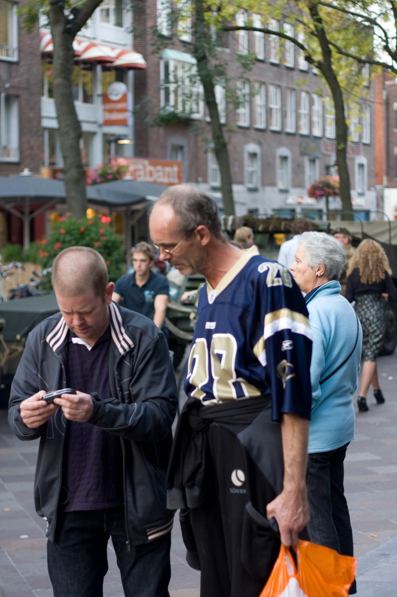

  
Kijk: Kees Kanker Kachel, een Eindhovense BN'er!  
Gespot tijdens het fakkeldefilee in Eindhoven, 65 jaar bevrijd  
[http://www.youtube.com/watch?v=3CnlePZxeiU](http://www.youtube.com/watch?v=3CnlePZxeiU)

  

