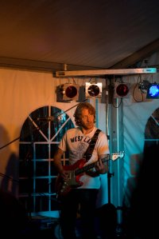
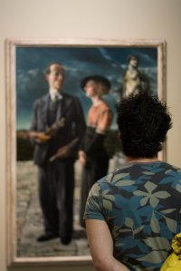
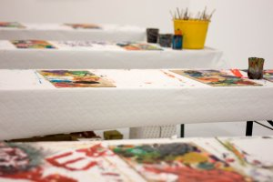

  
  
Geinig bandje...  
  
  
  
  
Zware shit...  
  
  
  
  
  
  
Lekker freubelen met verf onder leiding van Lex Grote. Oftewel [GroteKunst](http://www.grotekunst.nl/)  
  
  
  
  
  
Verantwoorden DJ'en met een borrel onder leiding van Lady Aïda

