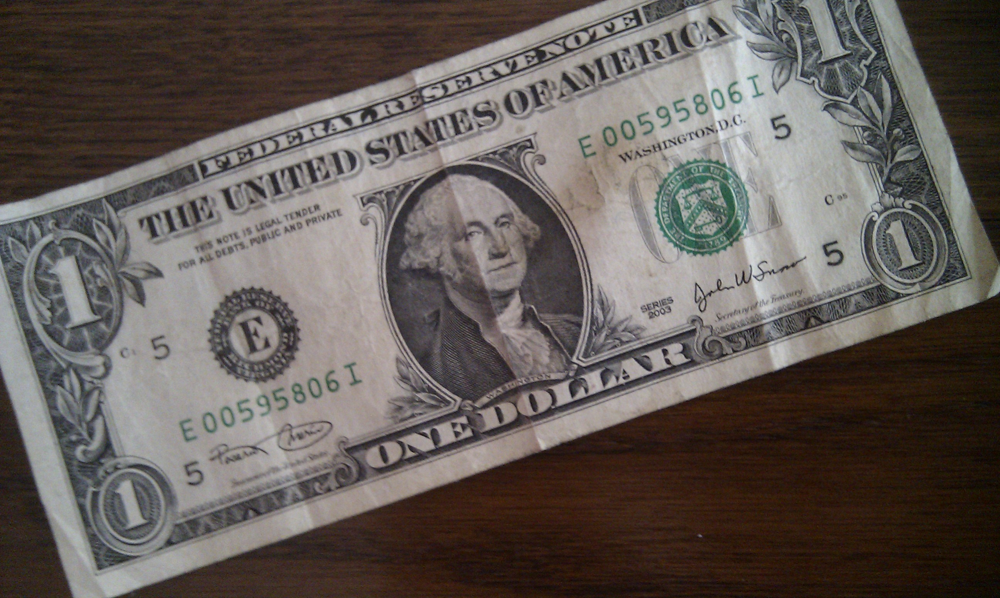

Enkele weken geleden ben ik mijn 40ste gepasseerd. Dit heb ik toen gevierd met leuke mensen in de kroeg. Iedereen cadeaus meegenomen (had niet gehoeven enzo) waaronder een fles Sake (dus toch nog een beetje Japan dit jaar).

Maar van [@Hans\_Truin](https://twitter.com/#!/Hans_Truin) kreeg ik een bijzonder geschenk. Een 'Lucky Dollar' die hij gekregen heeft toen hij in New York 40 werd (misschien dus wel heel lang geleden ;-) Overigens volgde ik Hans al een tijdje op Twitter maar was dit de eerste keer dat ik hem IRL ontmoette! Blijkt hij trouwens in het echt een enorm geschikte peer te zijn.

Dus zoals ze in Eindhoven wel eens zeggen: Dah ge bedankt bent... dah witte! De komende 40 zit ik geramd!

Hier de Lucky Dollar in kwestie:

Blijkbaar is het een traditie want meer info [hier](http://www.samanthalam.com/olympics/beijing3/).

P.s. volgens Hans stinkt hij ook echt, ik heb er nog niet aan durven te ruiken