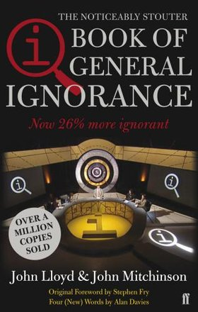

\[caption id="attachment\_971" align="alignnone" width="280"\] Book of General Ignorance\[/caption\]

Meer info via [Wikipedia.](http://en.wikipedia.org/wiki/The_Book_of_General_Ignorance)

Ik heb deze spontaan via Amazon gekocht omdat ik soms de verfilming hiervan op de BBC volg. De show word dan gehost door Stephen Fry (altijd briljant, ik geloof dat ik bijna al zijn boeken in boekenkast heb staan) , bijgestaan door enkele Engelse comedians.

Okay, het boek heeft niet dezelfde hoeveelheid typische Britse humor maar de feitjes blijven wel overeind. Nu ga ik ze hier niet allemaal opnoemen maar enkele mooie voorbeelden zijn (scroll verder voor de spoilers):

1. What's three times as dangerous as war?
2. Who lives in igloos?
3. Where was baseball invented?

Ik kan het aanbevelen voor op vakantie!

Oh... en de reden waarom ik er zo'n fan van ben? De voor de hand liggende antwoorden zijn niet altijd goed, vandaar mijn serie 'borrelpraat' op deze blog. Soms nemen mensen niet de tijd om zichzelf af te vragen 'is dat wel zo?'.

\[spoileralert\]

1. Work, 2.000.000 mensen sterven jaarlijks door werkgerelateerde zaken i.t.t. tot oorlog (650.000)
2. Niemand, meeste iglo's bestaan uit o.a. steen en de iglo's uit ijs werden zeer beperkt in het verleden gebouwd.
3. Engeland, +/- 1744