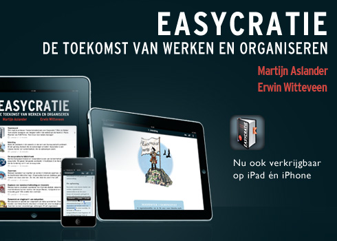

* Easycratie*

**Hoe kom ik er aan en waarom heb ik het gekocht?**

Tijdens 1 van de [SMC040](http://www.smc040.nl/2012/04/videoverslag-martijn-aslander/)  bijeenkomsten was Martijn als spreker aanwezig waardoor ik de dag erop gelijk het boek gedownload heb van het internet.

**Inhoud van het boek:**

Dit boek is een beetje vreemde eend in de bijt in m'n boekencollectie. Dit is zo'n beetje het eerste boek wat gratis is uitgegeven en ook het eerste e-book wat ik in mijn bezit heb.

Ik wilde al langer hier een verslag over schrijven maar het heeft dus even geduurd voordat het zover kwam. Afijn, 1 jaar verder is het me eindelijk gelukt.

Het (e-)boek beschrijft enkele bekende voorkomende problemen in de maatschappij zoals de problematiek met de hypotheken, pensioenen, zorg- en immigratie. Het falende systeem wat ervoor zorgt dat er geen oplossingen komen en de oorzaken daarvan.

De insteek van de schrijvers is dat met de voortschrijdende techniek mensen snel kennis kunnen delen en samenwerken om zo complexe vraagstukken te beantwoorden. Zonder gehinderd te worden door complexe organisaties of bureaucratie die uitvoering vertragen of tegenwerken. Hierdoor is het overzicht van wat er precies gedaan moet worden niet meer duidelijk en word er alleen gestuurd op aandeelhoudersbelangen.

Als voorbeelden worden enkele innovaties genoemd die een vooruitgang zijn en een win/win situatie opleveren voor bedrijven en klanten. Bijvoorbeeld het gebruik van SMS dat de vliegtickets vervangt bij KLM: geen bureaucratische rompslomp, kostenbesparingen en klantvriendelijker.

**Zou ik het andere mensen aanraden?**

**Ja, doen!** Eigenlijk is er geen reden om het boek niet te lezen. Het zorgt voor een frisse blik hoe het wel kan en het is ook nog eens gratis. Value for money gecombineerd met een aha erlebnis!