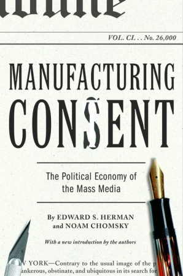

Dit is één van de betere boeken die ik in 2011 heb mogen lezen. Van te voren had ik op internet al één en ander van hem gelezen en diverse podcasts geluisterd. Afijn, laat Google los op "Noam Chomsky" en je komt al een heel eind. Dit boek is ook verfilmd met de gelijknamige titel. De boodschap is hetzelfde alhoewel ik het boek wel krachtiger vind.

Dit boek beschrijft de rol van de media in het dagelijkse leven en zoals de titel aangeeft "Manufacturing Concent".

O.a. word het "propaganda model" uitgelegd (zie ook [Wikipedia](http://en.wikipedia.org/wiki/Propaganda_model)) waarin beschreven word aan welke invloeden de media bloot staat en deze gebruikt word als propaganda voor mensen die het niet altijd het beste met de  democratie voor hebben.

Enkele, voor mij, smakelijke ontdekkingen en quotes:

"the virtual communitiesare organized to buy and sell goods, not to create or service a public sphere"

"advertisers don't like the public sphere, where audiences are small and upsetting controversy takes place and settings are not ideal for selling goods"

"entertainment is used for selling goods. An effective verhicle for selling hidden idealogic messages. And diverts the people from politics and ... "

".. Media is controlled by 9 private persons and affiliated with company executives..."

Afijn, de uiteindelijk boodschap is: Blijf geïnformeerd!

P.s. recentelijk verscheen er een artikel op [Zerohedge.com](http://www.zerohedge.com/contributed/top-social-media-websites-caught-censoring-controversial-content?utm_source=feedburner*utm_medium=feed*utm_campaign=Feed%3A+zerohedge%2Ffeed+%28zero+hedge+-+on+a+long+enough+timeline%2C+the+survival+rate+for+everyone+drops+to+zero%29) wat aangaf dat deze praktijken het ook in de virtuele wereld van internet gebeurd. Mensen worden betaald om content te "liken" of te markeren als spam/abbuse...