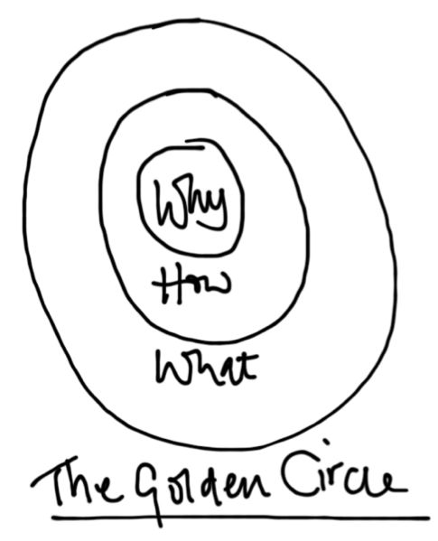

Ik heb dit boek gekocht nadat ik een referentie naar hem op de [TED](http://www.ted.com), die in [Eindhoven georganiseerd](http://www.ted.com/tedx/events/1595) werd, wees. Het ging om [deze](http://www.ted.com/talks/simon_sinek_how_great_leaders_inspire_action.html) video die ik toen bekeek. Het sprak me meteen aan en vond het gelijk een geweldig en simpel verhaal, reden waarom ik het boek (wat niet eens de hoofdprijs kostte) bij [Amazon](http://www.amazon.com/Start-Why-Leaders-Inspire-Everyone/dp/1591842808/ref=sr_1_1?ie=UTF8*qid=1318964873*sr=8-1) gekocht heb.

Het boek begint met uit te leggen waar mensen door beïnvloed kunnen worden. Manipulatie vs Inspiratie. O.a. prijs, promoties, angst, aspiraties, groepsdruk, gadgets/nieuwigheidjes/innovatie. En legt uit dat deze vorm van manipulatie wel leid tot meer transacties maar niet tot loyaliteit aan een product en of merk.

Vervolgens word, in 200 pagina's (het idee had achteraf ook op een A4'tje uitgelegd kunnen worden), uitgelegd waarom het gebruik van de 'Why' wel leid tot inspiratie en loyaliteit van mensen aan het idee en of product.

En geeft voorbeelden waarom mensen enorm aangetrokken zijn tot een merk als Apple (het doorbreken van de Status Quo), de lifestyle die er bij hoort zoals bij Harley Davidson (Free to ride) en de verven van Akzo (een kleurrijke wereld).

E.e.a. word aangevuld en uitgelegd met de 'golden circle' waar bedrijven die zich op het "hoe" en "wat" concentreren vaak niet succesvol zijn.

Voor de mensen die het allemaal teveel lezen vinden kunnen een mindmap van het boek [hier](http://mastermindmaps.wordpress.com/2011/08/27/live-mindmapping-ted-talk/) vinden.

Note: Na het lezen van dit boek ben ik begonnen met het boek "Sleigth of Mouth" (1999!) en hier word e.e.a. ook over uitgelegd. Blijkbaar is deze manier van denken al veel langer bekend en heeft de auteur het in een nieuw vormpje weten te gieten. Word vervolgd!