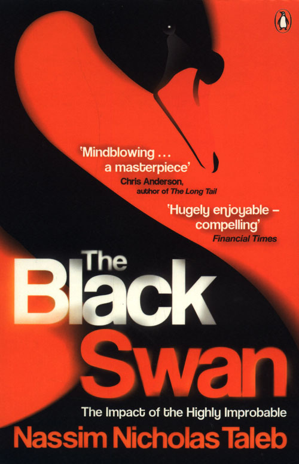

Boekbespreking: “The Black Swan” , Nassim Nicholas Taleb

**

Ik kwam de titel van dit boek regelmatig tegen op financiële websites. Vooral na de 1e financiële crises in 2008, dus toen deze met korting EN voor een zacht prijsje bij de Selexyz lag kon ik h'm natuurlijk niet laten liggen.

Was even bang dat het een taai boek zou zijn maar niets is minder waar. Ik heb het boek dan ook in een recordtempo (voor mijn doen) uitgelezen. De schrijver is niet alleen goed in statistieken maar ook nog eens filosoof. Een goede combinatie denk ik om droge stof smakelijk te brengen.

Gedurende het lezen heb ik diverse aantekeningen voor mezelf gemaakt, teveel om hier nog eens over te nemen.

Maar waar het volgens mij om draait is dit... de wereld is niet meer voorspelbaar zoals deze in het verleden was. Hij beschrijft dit ook in zijn boek: "Mediocristan" zoals het was en "Extremistan" zoals de wereld er nu uit begint te zien.

In het eerste geval zijn veel dingen met de traditionele statistieken (bell curves) nog goed te vangen en te voorspellen terwijl in het laatste dit niet meer van toepassing is.

De wereld is zo genetwerkt met elkaar dat een falen aan de ene van de wereld meteen tot problemen kan leiden aan de andere kant van de wereld. Omvallen van banken, natuurrampen door gebeurtenissen die niet eerder zijn voorgekomen of uniek waren (o.a. 9/11, Tsunami in Japan 2011, etc.). In het kort: 'als iets nog nooit gebeurd is wil nog niet zeggen dat het niet zal gebeuren'.

Het mooie is dat hij deze gebeurtenissen niet alleen beschrijft maar ook met een 'bescherming' komt tegen zulke onwaarschijnlijke gebeurtenissen ('four quadrants').

Voor de mensen die niet het hele boek willen lezen: Op "mastermindmaps" website staat een mindmap die het geheel nog eens samenvat: [http://mastermindmaps.wordpress.com/2010/11/22/black-swans/](http://mastermindmaps.wordpress.com/2010/11/22/black-swans/)