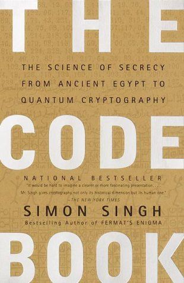

"the science of secrecy from ancient egypt to quantum cryptography"

**Hoe kom ik er aan en waarom heb ik het gekocht?**

Na het lezen van een boek over het leven op Bletchley Park in Engeland (waar de Engelse codebreakers gehuisvest waren tijdens de 2e wereldoorlog) had ik besloten hier meer over te willen weten. Wat misschien ook meespeelde is wat er tegenwoordig allemaal te doen is over privacy en het opslaan van gegevens via internet.

Na een korte zoektocht op internet kwam ik deze versie tegen. Het beschrijft de meestgebruikte (de)codeertechnieken in de geschiedenis van de mens. Niet alle hoofdstukken zijn even boeiend om te lezen omdat geschiedenis met techniek afgewisseld word.

Natuurlijk komt ook de 'Enigma' machine aan bod en degene, Alan Turing, die mee heeft geholpen aan de breken van de gebruikte codes / mechanisme. Tegelijkertijd de basis gelegd voor de computers zoals we die nu gebruiken. Helaas ook het trieste einde hoe deze geniale man aan zijn einde is gekomen.

Het laatste hoofdstuk laat ons een stukje in de toekomst kijken door het gebruik van quantum cryptography. Voorlopig nog even geen realiteit.