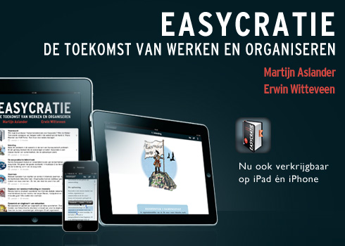

Als "professional" lees ik (veel) boeken ;-) Om u daar ook van te laten profiteren schrijf ik regelmatig boekbesprekingen:

[Boekbespreking: “Easycratie”, Martijn Aslander en Eric Witteveen](../boekbespreking-easycratie-martijn-aslander-en-eric-witteveen/)

# [Boekbespreking: “Oersterk”, Richard de Leth](http://markdebont.wordpress.com/2013/01/31/boekbespreking-oersterk-richard-de-leth/)

# [Boekbespreking: “Tricks of the Mind”, Derren Brown](../boekbespreking-tricks-of-the-mind-derren-brown/)

*Derren Brown*

# [Boekbespreking: "the Code Book", Simon Singh](http://wp.me/p1tLVU-h6)

# [Boekbespreking: “Book of General Ignorance”, John Lloyd 
*John Mitchinson](http://markdebont.wordpress.com/2012/05/31/boekbespreking-book-of-general-ignorance-john-lloyd-john-mitchinson/)

\[caption id="attachment\_971" align="alignnone" width="280"\] Book of General Ignorance*

# **[Manufacturing Consent, Noam Chomsky](../boekbespreking-manufacturing-concent-noam-chomsky/)**

Manufacturing Consent

As quoted by [BBC news](http://www.bbc.co.uk/news/business-14093772) :

"[Pioneered by Edward Herman and Noam Chomsky](http://www.chomsky.info/onchomsky/198901--.htm), the theory states that essentially the mass media is a propaganda machine; that the advertising model makes large corporate advertisers into "unofficial regulators"; that the media live in fear of politicians; that truly objective journalism is impossible because it is unprofitable (and plagued by "flak" generated within the legal system by resistant corporate power)."

Anyway, dit boek heeft me geleerd ook andere media op te zoeken en te beluisteren i.p.v. de CNN/Fox news.

**Update 12/07/2011**: http://www.bbc.co.uk/news/business-14093772 Manufacturing Consent at work

# [“Sky Sweeper”, Phillis Gershator](../boekbespreking-sky-sweeper-phillis-gershator/)

sky sweeper 

Een boek voor kleine kinderen maar met een boodschap!

[“The Black Swan” , Nassim Taleb](../boekbespreking-the-black-swan-nassim-taleb/)

* the Black Swan*

# [“Start with Why” , Simon Sinek](../boekbespreking-start-with-why-simon-sinek/)

* Start with why*

# [Het Blauwe Boekje, Stijlgids, De Vries 
*Wolbrink](http://markdebont.wordpress.com/2011/11/06/boekbespreking-het-blauwe-boekje-de-vries-wolbrink/)

07/11/2011

\[caption id="attachment\_614" align="alignnone" width="512"\] Het blauwe boekje*

\* De volgende moet ik nog beschrijven/zijn onderweg \*

## Up Your Service, Ron Kaufman

Dit boek ligt al jaren op mijn bureau. Het beschrijft vele praktische voorbeelden om service in de organisatie te verhogen. Het leukste vind ik de verschillende serviceniveau's beschrijft waar 'Criminal' onderaan staat.

## Musashi

* miyamoto-musashi*

t.b.a.