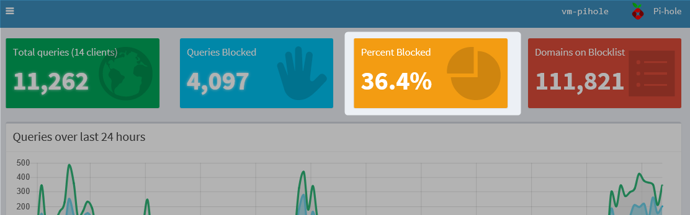
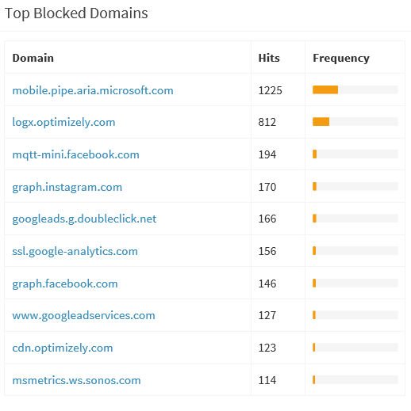

Eens in de zoveel jaar loop je tegen een stukje software aan waarvan je dacht : "dat had ik veel eerder moeten hebben" : [Pi-Hole](https://pi-hole.net/). Een korte tijd was ik een roepende in een woestijn tot dat meerdere connecties op social media het gingen gebruiken. Wat is het?

In het kort: Pi-Hole zorgt ervoor dat iedereen thuis (mobiele) internet apparatuur zonder reclame kan gebruiken. Waar je eerst ad-blockers etc. op elk apparaat moest installeren en beheren doe je dat nu met één centrale app: Pi-Hole.

Bij mij thuis hebben we verschillende apparaten en OS'en. Windows PC, Android telefoon, Appel tablet en ga zo maar door. En op elk platform wilde je natuurlijk de websites bezoeken zonder reclames. Nu kon ik dat nog wel beheren, wat ook een heel gedoe was, maar zie dit maar aan je ouders uit te leggen.

## Hoe werkt het?

Na installatie, waarover later meer, gaan alle DNS requests via Pi-Hole. DNS zorgt ervoor dat de URL die je intypt, b.v. www.nu.nl, omzet naar een IP adres. Vervolgens haalt je apparaat dan de website binnen. Pi-Hole zorgt ervoor dat alle ongewenste (reclame) info geblokkeerd worden. Het zorgt er dus voor dat de informatie niet eens aankomt op het betreffende apparaat

## Resultaat

Zie boven een screenshot van de resultaten. Gemiddeld blokeerd Pi-Hole zo'n **33%** aan verkeer. Het geeft ook geweldige statistieken van wat er 24/7 door je internet verbinding gaat. Het gaat niet alleen om reclame maar ook allerlei tracker(s) die op je apparaten geplaatst worden. Deze worden hiermee ook geblokkeerd. Denk aan Spotify, Facebook, instagram etc.e tc.

Zo staan de iPad's elk half uur met Apple te pollen (!), je NetAtmo thermostaat, Garmin sporthologe, Spotify die alles doorspuugt, Netflix. Pinterest die 's-nachts nog even wat gegevens opvraagt/doorspeelt en e-mail die 24/7 opgehaald word.

Dit kan oplopen tot 6 (!) queries per minuut. 24/7.

Hieronder b.v. een lijst van domeinen die geblokeerd word.

Pi-Hole geeft verder nog meer informatie welke sites veel bezocht/geblokeerd worden en ook statistieken per device.

## Installatie

Installatie is nog niet heel eenvoudig voor de absolute beginner. Installeren moet vaak op een Raspberry Pi en een wijzigng in je internet router. Kosten zijn +/- 70 euro voor een complete Raspberry Pi set (voeding, behuzing, memory card).

Zelf draai het op een virtual machine op mijn Synology NAS.

Mijn ervaring is, na een klein half jaar, dat het erg stabiel is. Het systeem vraagt erg weinig resources en in de afgelopen periode heb ik geen restarts of reboots hoeven te doen omdat het systeem hing.

## UPDATE 2020

Inmiddels is deze vervangen door een aparte hardware box met PfBlocker-NG